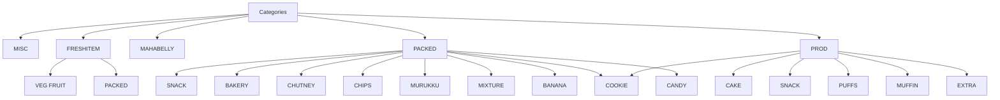

# ZapSlip Category System Reference

This document details the category system used in ZapSlip for classifying products.

## Category Structure



## Category Definitions

### Main Categories

1. **MISC**
   - Miscellaneous items
   - Items that don't fit other categories
   - Example: Brown Paper Carry Bag, Delivery Charge

2. **FRESHITEM**
   - Fresh produce and items
   - Subcategories:
     - VEG FRUIT: Fresh vegetables and fruits
     - PACKED: Packaged fresh items

3. **MAHABELLY**
   - Restaurant-specific items
   - No subcategories
   - Example: Alfaham Kerala Style, Kerala Shawarma

4. **PACKED**
   - Pre-packaged items
   - Multiple subcategories for different types of snacks and foods

5. **PROD**
   - Production items
   - Includes bakery and prepared foods
   - Multiple subcategories

## Subcategories

### PACKED Subcategories

1. **SNACK**
   - Sharkara Varatti
   - Madhura Seva
   - Kuzhalappam Sweet
   - Roasted Peanut
   - etc.

2. **BAKERY**
   - Kerala Laddu
   - Dilkush / Coconut Bun
   - Sweet Porotta
   - Sweet Bun / Soft
   - etc.

3. **CHUTNEY**
   - Coconut Chutney Powder
   - Prawns Chutney Powder
   - Gun Powder Chutney
   - etc.

4. **CHIPS**
   - Tapioca Chips
   - Jackfruit Chips
   - etc.

5. **MURUKKU**
   - Chilli Onion Murukku
   - Stick Murukku
   - Round Murukku
   - etc.

6. **MIXTURE**
   - Payyoli Mixture
   - Bombay Mixture
   - Kerala Spicy Mixture
   - etc.

7. **BANANA**
   - Super Thin Banana Chips
   - Various flavors and styles

8. **COOKIE**
   - Oats & Jaggery Cookies
   - Spicy Masala Cookies
   - etc.

9. **CANDY**
   - Traditional candies
   - Petti Kada Mittai varieties

### PROD Subcategories

1. **CAKE**
   - Jackfruit Cake
   - Choco Mud Cake
   - Carrot and Dates Cake
   - etc.

2. **SNACK**
   - Kuboos
   - Paneer Roll
   - Chicken Roll
   - etc.

3. **PUFFS**
   - Paneer Puffs
   - Chicken Puffs
   - Egg Puffs
   - etc.

4. **MUFFIN**
   - Blueberry Muffin
   - Chocolate Muffin
   - Pineapple Muffin
   - etc.

5. **COOKIE**
   - Oats & Raisins Cookie
   - etc.

6. **EXTRA**
   - Grated Kerala Coconut
   - Cleaned Nadan Cheriya Ulli
   - Arabian Pulpy Grape Juice
   - etc.

## Category Assignment Rules

1. **Direct Matching**
   - Exact product name match in lookup table
   - Case-insensitive comparison

2. **Normalized Matching**
   - Remove special characters
   - Standardize spacing
   - Compare normalized names

3. **Word-based Matching**
   - Split product names into words
   - Match based on word presence
   - Consider word order

4. **Fallback**
   - If no match found, categorize as "Uncategorized"
   - Manual review may be needed

## Maintaining Categories

### Adding New Products

1. Update `category-lookup.js`:
   ```javascript
   "New Product Name": {
       sheet: "MAIN_CATEGORY",
       type: "SUBCATEGORY"
   }
   ```

2. Update `category-lookup.ts` with the same entry

### Modifying Categories

1. Update both JS and TS lookup files
2. Consider impact on existing reports
3. Update documentation if needed

### Best Practices

1. Use consistent naming conventions
2. Keep subcategories logical and organized
3. Document any special cases
4. Regular review and cleanup of categories
5. Maintain backwards compatibility 