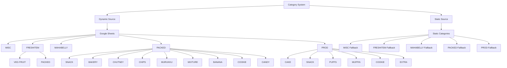
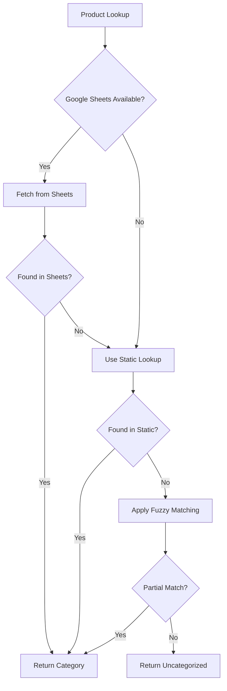
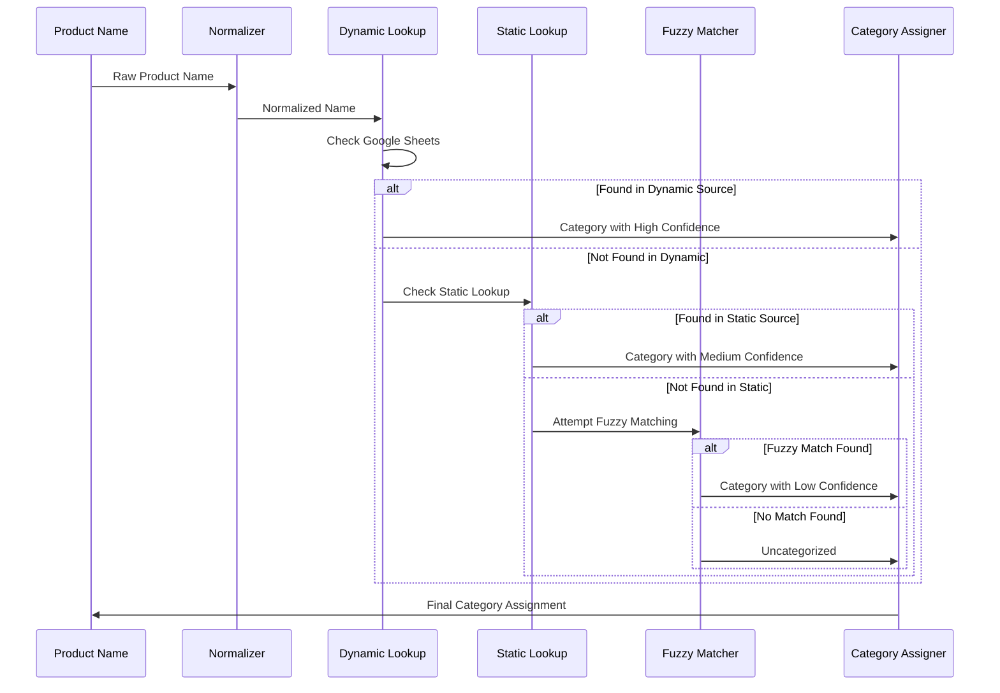

# ZapSlip Category System Reference

This document details the enhanced category system used in ZapSlip for classifying products, including the new dynamic Google Sheets integration and advanced matching algorithms.

## Overview

The ZapSlip category system has been upgraded to a **dual-source dynamic categorization system** that combines real-time Google Sheets data with static fallback categories. This ensures maximum flexibility while maintaining reliability.

## Category Structure



## Dynamic Category System

### Google Sheets Integration

The system now fetches category data in real-time from a Google Sheets document, enabling:
- **Live Updates**: Category changes reflect immediately without code deployment
- **Collaborative Management**: Multiple users can maintain categories
- **Version History**: Google Sheets tracks all changes automatically
- **Scalability**: Easy addition of new products and categories

#### Data Source Configuration:
```javascript
const GOOGLE_SHEETS_CSV_URL = 
    'https://docs.google.com/spreadsheets/d/1WpQGDlmLcBbfIsk9Yehwr2snozVll1swa22eOBiMhnM/export?format=csv&gid=0';
```

#### Expected Sheet Format:
| Product Name | Sheet Category | Type Subcategory |
|-------------|----------------|------------------|
| Kerala Laddu | PACKED | BAKERY |
| Jackfruit Cake | PROD | CAKE |
| Tapioca Chips | PACKED | CHIPS |

### Fallback Mechanism

When Google Sheets is unavailable, the system automatically falls back to a comprehensive static category lookup:



## Advanced Matching Algorithms

### 1. Product Name Normalization

Before matching, product names undergo comprehensive normalization:

```javascript
export function normalizeProductName(name) {
    return name
        // Remove portion sizes and units
        .replace(/\s*\d+\s*(ml|ML|Lt|LT|g|gm|GM|kg|KG|Kg)\b/g, '')
        // Remove empty parentheses
        .replace(/\(\s*\)/g, '')
        // Normalize spaces
        .replace(/\s+/g, ' ')
        .trim();
}
```

**Examples:**
- `"Kerala Laddu 250g"` → `"Kerala Laddu"`
- `"Tapioca Chips  500 ML"` → `"Tapioca Chips"`
- `"Jackfruit Cake ( )"` → `"Jackfruit Cake"`

### 2. Multi-Strategy Matching

The system employs multiple matching strategies in order of preference:

#### Strategy 1: Exact Match
- Direct lookup in dynamic categories
- Case-insensitive exact matching
- Highest confidence level

#### Strategy 2: Normalized Match
- After product name normalization
- Handles variations in spacing and units
- High confidence level

#### Strategy 3: Fuzzy Word-Based Match
- Splits product names into words
- Checks for word presence in either direction
- Handles partial matches and word order variations
- Medium confidence level

```javascript
// Example fuzzy matching logic
const itemWords = itemNameLower.split(/\s+/);
const keyWords = keyLower.split(/\s+/);

// Check if all words in either string are contained in the other
const itemContainsKey = keyWords.every(word => itemNameLower.includes(word));
const keyContainsItem = itemWords.every(word => keyLower.includes(word));

return itemContainsKey || keyContainsItem;
```

#### Strategy 4: Best Product Match
- Uses advanced algorithm to find closest product
- Considers character similarity and context
- Lower confidence but prevents uncategorized items

## Category Definitions

### Main Categories

#### 1. **MISC** (Miscellaneous)
- **Purpose**: Items that don't fit standard food categories
- **Examples**: 
  - Brown Paper Carry Bag
  - Delivery Charge
  - Gift Wrapping
  - Service Fees

#### 2. **FRESHITEM** (Fresh Products)
- **Purpose**: Fresh produce and perishable items
- **Subcategories**:
  - **VEG FRUIT**: Fresh vegetables and fruits
  - **PACKED**: Packaged fresh items
- **Examples**:
  - Fresh vegetables
  - Seasonal fruits
  - Dairy products
  - Fresh herbs

#### 3. **MAHABELLY** (Restaurant Items)
- **Purpose**: Restaurant-specific prepared foods
- **Characteristics**: Ready-to-eat items from restaurant menu
- **Examples**:
  - Alfaham Kerala Style
  - Kerala Shawarma
  - Biriyani varieties
  - Curry dishes

#### 4. **PACKED** (Pre-packaged Goods)
- **Purpose**: Manufactured and packaged food items
- **Quality**: Shelf-stable products with longer expiry
- **Multiple subcategories** for organized classification

#### 5. **PROD** (Production Items)
- **Purpose**: In-house produced bakery and prepared foods
- **Characteristics**: Fresh production items made in-house
- **Quality**: Usually requires refrigeration or quick consumption

## Enhanced Subcategories

### PACKED Subcategories

#### **SNACK**
- Traditional snacks and savory items
- **Examples**: Sharkara Varatti, Madhura Seva, Kuzhalappam Sweet, Roasted Peanut
- **Characteristics**: Ready-to-eat, shelf-stable

#### **BAKERY**
- Baked goods and sweet items
- **Examples**: Kerala Laddu, Dilkush/Coconut Bun, Sweet Porotta, Sweet Bun/Soft
- **Shelf Life**: Medium-term storage

#### **CHUTNEY**
- Powder-based condiments and chutneys
- **Examples**: Coconut Chutney Powder, Prawns Chutney Powder, Gun Powder Chutney
- **Usage**: Condiments and flavor enhancers

#### **CHIPS**
- Fried and crispy snacks
- **Examples**: Tapioca Chips, Jackfruit Chips, Banana Chips
- **Texture**: Crispy, fried items

#### **MURUKKU**
- Traditional South Indian spiral snacks
- **Examples**: Chilli Onion Murukku, Stick Murukku, Round Murukku
- **Shape**: Characteristic spiral or stick shapes

#### **MIXTURE**
- Spicy mixed snacks
- **Examples**: Payyoli Mixture, Bombay Mixture, Kerala Spicy Mixture
- **Composition**: Mix of various fried ingredients

#### **BANANA**
- Banana-based products
- **Examples**: Super Thin Banana Chips (various flavors)
- **Specialization**: Banana-derived products

#### **COOKIE**
- Baked cookies and biscuits
- **Examples**: Oats & Jaggery Cookies, Spicy Masala Cookies
- **Texture**: Baked, crunchy items

#### **CANDY**
- Traditional sweets and candies
- **Examples**: Petti Kada Mittai varieties
- **Type**: Traditional confectionery

### PROD Subcategories

#### **CAKE**
- Fresh cakes and cake products
- **Examples**: Jackfruit Cake, Choco Mud Cake, Carrot and Dates Cake
- **Freshness**: Requires refrigeration

#### **SNACK**
- Fresh prepared snacks
- **Examples**: Kuboos, Paneer Roll, Chicken Roll
- **Preparation**: Freshly made items

#### **PUFFS**
- Pastry-based items
- **Examples**: Paneer Puffs, Chicken Puffs, Egg Puffs
- **Type**: Pastry with fillings

#### **MUFFIN**
- Individual portion cakes
- **Examples**: Blueberry Muffin, Chocolate Muffin, Pineapple Muffin
- **Format**: Single-serving baked goods

#### **COOKIE**
- Fresh-baked cookies
- **Examples**: Oats & Raisins Cookie
- **Distinction**: Fresh production vs. packaged

#### **EXTRA**
- Specialty and miscellaneous production items
- **Examples**: Grated Kerala Coconut, Cleaned Nadan Cheriya Ulli, Arabian Pulpy Grape Juice
- **Variety**: Diverse specialty items

## Category Assignment Process

### Enhanced Assignment Flow



### Confidence Levels

1. **High Confidence** (Google Sheets exact match)
   - Direct lookup in live data
   - Most reliable categorization
   - Real-time accuracy

2. **Medium Confidence** (Static lookup match)
   - Fallback to proven categories
   - Reliable but potentially outdated
   - Stable categorization

3. **Low Confidence** (Fuzzy match)
   - Best-effort categorization
   - May require manual review
   - Prevents uncategorized items

4. **No Confidence** (Uncategorized)
   - No suitable match found
   - Requires manual intervention
   - Clear indication of missing data

## Managing Categories

### Google Sheets Management

#### Adding New Products:
1. **Access the Google Sheet** using the configured URL
2. **Add a new row** with:
   - Product Name (exact as it appears in PDFs)
   - Sheet Category (MISC, FRESHITEM, MAHABELLY, PACKED, PROD)
   - Type Subcategory (specific subcategory)
3. **Save the sheet** - changes are live immediately

#### Best Practices:
- **Consistent Naming**: Use exact product names as they appear in PDFs
- **Regular Review**: Periodically audit categories for accuracy
- **Documentation**: Add comments in sheets for special cases
- **Backup**: Keep local backup of critical category data

### Static Fallback Maintenance

#### Updating Static Categories:
1. **Modify `category-lookup.js`**:
   ```javascript
   "New Product Name": {
       sheet: "MAIN_CATEGORY",
       type: "SUBCATEGORY"
   }
   ```

2. **Update `category-lookup.ts`** with matching TypeScript definitions

3. **Test thoroughly** to ensure no breaking changes

### Monitoring and Analytics

#### Category Performance Metrics:
- **Match Rate**: Percentage of products successfully categorized
- **Confidence Distribution**: Breakdown by confidence levels
- **Uncategorized Items**: Products requiring attention
- **Fuzzy Match Accuracy**: Effectiveness of partial matching

#### Debugging Tools:
```javascript
// Enhanced logging for category assignment
console.log('Looking up category for:', cleanedName);
console.log('Category found:', category);
console.log('Match confidence:', confidence);
```

## Advanced Features

### Product Name Cleaning

The system includes sophisticated product name cleaning:

```javascript
function cleanItemName(name) {
    // Remove quantity-related text
    let cleaned = name.replace(/\d+\s*(?:Pcs?|Gm|g\b|of\s+\d+|ml|ML|Lt|Litre|Liter|Packet|Pkt|Pack)/gi, '');
    
    // Preserve important product information like "For X People"
    // Remove only measurement-related parentheses
    cleaned = cleaned
        .replace(/\((?:After cleaning[^)]*|approx\.?[^)]*|about[^)]*|around[^)]*|\d+(?:g|gm|Gm|kg|ml|ML|Lt|Litre|Liter|Packet|Pkt|Pack)[^)]*)\)/gi, '')
        .replace(/\(([^)]+)\)/g, (match, content) => {
            if (/^\s*\d+(?:g|gm|Gm|kg|ml|ML|Lt|Litre|Liter|Packet|Pkt|Pack)\s*$/i.test(content)) {
                return '';
            }
            return ' ' + content; // Keep important descriptions
        })
        .replace(/\s*[,\/]\s*/g, ' ')
        .replace(/\s+/g, ' ')
        .replace(/\s*-\s*$/, '')
        .trim();
    
    return cleaned;
}
```

### Error Handling and Recovery

#### Graceful Degradation:
- **Network Issues**: Automatic fallback to static categories
- **Malformed Data**: Skip problematic entries with logging
- **API Limits**: Implement caching and retry mechanisms

#### Error Reporting:
```javascript
// Comprehensive error tracking
try {
    const category = await getCategoryInfo(productName);
    return category;
} catch (error) {
    console.error('Category lookup failed:', error);
    trackCategoryError(productName, error);
    return fallbackCategory(productName);
}
```

## Future Enhancements

### Planned Improvements:
1. **Machine Learning Integration**: AI-powered category suggestion
2. **Multi-language Support**: Categories in multiple languages
3. **Custom Category Rules**: User-defined categorization logic
4. **Analytics Dashboard**: Visual category performance metrics
5. **Batch Category Updates**: Bulk category management tools

### Integration Possibilities:
- **Inventory Management**: Link categories to stock systems
- **Nutritional Information**: Add nutritional data per category
- **Pricing Intelligence**: Category-based pricing analysis
- **Supplier Management**: Map categories to suppliers 