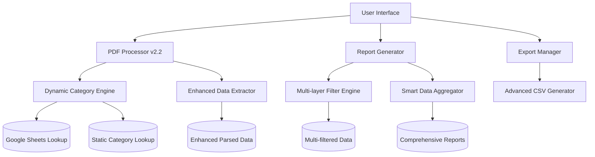

# ZapSlip Documentation

ZapSlip is a browser-based utility for processing and analyzing packing slip PDFs. It provides an intuitive interface for uploading multiple PDFs, categorizing products, and generating detailed reports.

## Table of Contents

1. [System Overview](#system-overview)
2. [Architecture](#architecture)
3. [Features](#features)
4. [Recent Updates](#recent-updates)
5. [File Structure](#file-structure)
6. [Setup Guide](#setup-guide)
7. [User Guide](#user-guide)

## System Overview

ZapSlip streamlines the process of managing and analyzing packing slips by:
- Processing multiple PDF files simultaneously with enhanced parsing algorithms
- Automatically categorizing products using dynamic Google Sheets integration
- Providing filterable reports with real-time data processing
- Enabling Excel exports of various report types
- Supporting complex filename patterns and product name variations

## Architecture

The system is built using vanilla JavaScript and runs entirely in the browser. It uses PDF.js for PDF processing and implements a modular architecture with dynamic data sources for maintainability and flexibility.



## Features

### 1. Enhanced PDF Processing
- **Advanced Text Extraction**: Multi-page processing with improved text positioning
- **Intelligent Product Parsing**: Handles multi-line product names and embedded quantities
- **Flexible Filename Support**: Robust regex patterns for various filename formats
- **Duplicate Prevention**: Smart detection of repeated product entries
- **Real-time Processing**: Progress indicators and status updates

### 2. Dynamic Product Categorization
- **Google Sheets Integration**: Live category lookup from cloud-based spreadsheet
- **Dual Lookup System**: Primary Google Sheets with static fallback
- **Smart Matching Algorithm**: Multiple matching strategies including:
  - Exact name matching
  - Normalized text comparison
  - Word-based partial matching
  - Product name cleaning and standardization
- **Support for Category Types**:
  - MISC (Miscellaneous items)
  - FRESHITEM (Fresh produce)
  - MAHABELLY (Restaurant items)
  - PACKED (Pre-packaged goods)
  - PROD (Production items)

### 3. Advanced Reporting
- **Product Summary View**
  - Aggregated quantities across all orders
  - Category assignments with confidence indicators
  - Order traceability and source tracking
  - Portion size information where available
- **Category Summary View**
  - Category-wise totals and breakdowns
  - Product diversity metrics
  - Detailed statistics and analytics
  - Expandable detail views

### 4. Multi-layer Filtering System
- **Date Range Filtering**: Flexible date format support
- **Customer Filtering**: Partial name matching with case insensitivity
- **Product Filtering**: Smart product name searching
- **Category Filtering**: Exact category matching with subcategory support

### 5. Comprehensive Export Options
- **Product Summary Export**: Complete product analysis
- **Category Summary Export**: Category-wise breakdowns
- **Orders Export**: Full order details with customer information
- **Detailed Product Breakdown**: Granular product analysis with sourcing

## Recent Updates

### Version 2.2 - Enhanced Parsing & Dynamic Categories

#### PDF Parser Improvements
- **Fixed Customer Name Extraction**: Resolved issues with filenames containing trailing spaces and periods (e.g., "Jayashree ._")
- **Flexible Date Format Support**: Now handles both `DD.MM.YYYY` and `DD.MM` date formats
- **Duplicate Product Prevention**: Eliminates duplicate entries for products with embedded quantities
- **Enhanced Product Name Parsing**: Better handling of multi-line product names and special characters
- **Improved Regex Patterns**: More robust pattern matching for various filename formats

#### Dynamic Category System
- **Google Sheets Integration**: Real-time category lookup from cloud-based data source
- **Fallback Mechanism**: Static category lookup as backup for offline scenarios
- **Product Name Normalization**: Advanced text cleaning for better matching accuracy
- **Multiple Matching Strategies**: Comprehensive approach to product categorization

#### Technical Enhancements
- **PDF.js Version Update**: Using stable version 3.11.174 for better compatibility
- **Error Handling**: Improved error recovery and user feedback
- **Performance Optimization**: Faster processing for large PDF sets
- **Debugging Support**: Enhanced console logging for troubleshooting

## File Structure

```
ZapSlip/
├── lib/
│   ├── pdf-parser.js           # Enhanced PDF processing (v2.2)
│   ├── pdf-parser.ts           # TypeScript definitions
│   ├── category-lookup.js      # Dynamic category system
│   ├── category-lookup.ts      # TypeScript category types
│   └── excel-export.js         # Advanced export functionality
├── docs/
│   ├── README.md              # Main documentation (this file)
│   ├── TECHNICAL.md           # Technical reference
│   └── CATEGORIES.md          # Category system documentation
├── reference/                 # Sample PDF files for testing
├── styles.css                # Application styles
├── index.html                # Main application interface
├── app.js                    # Core application logic
└── package.json              # Dependencies and scripts
```

## Setup Guide

### Prerequisites
- Modern web browser with ES6+ support
- Internet connection for Google Sheets integration
- Local web server for development

### Installation
1. **Clone the repository**
   ```bash
   git clone https://github.com/j1me/ZapSlip.git
   cd ZapSlip
   ```

2. **No build process required** - Static web application
   
3. **Serve the files using any web server**
   ```bash
   # Using Python
   python3 -m http.server 3000
   
   # Using Node.js
   npx serve .
   
   # Using Live Server (VS Code extension)
   # Just open index.html with Live Server
   ```

4. **Open in browser**
   - Navigate to `http://localhost:3000`
   - Ensure JavaScript is enabled

### Configuration
- **Google Sheets URL**: Update `GOOGLE_SHEETS_CSV_URL` in `category-lookup.js` if using custom sheet
- **PDF.js Version**: Modify `pdfJsVersion` in `pdf-parser.js` if needed

## User Guide

### Processing PDFs

#### Uploading Files
1. **Drag and Drop**: Drag PDF files onto the upload area
2. **File Browser**: Click the upload area to open file browser
3. **Multiple Selection**: Select multiple PDFs at once
4. **File Validation**: System checks for valid PDF format

#### Processing
1. **Click "Process Files"** to begin analysis
2. **Monitor Progress**: Real-time status updates during processing
3. **Error Handling**: Clear error messages for any issues
4. **Results Display**: Automatic navigation to reports after completion

### Using Reports

#### Navigation
- **Product Tab**: View product-wise summary and details
- **Category Tab**: View category-wise analysis and breakdowns
- **Toggle Views**: Switch between different report perspectives

#### Filtering Data
1. **Date Range**: 
   - Set start and end dates
   - Supports multiple date formats
   - Leave blank to include all dates

2. **Customer Filter**:
   - Enter partial or full customer name
   - Case-insensitive matching
   - Real-time filtering

3. **Product Filter**:
   - Search by product name
   - Partial matching supported
   - Instant results

4. **Category Filter**:
   - Select specific categories
   - Exact matching
   - Multiple category support

#### Exporting Data
1. **Click "Export to Excel"** to open export modal
2. **Select Report Types**:
   - Product Summary
   - Category Summary  
   - Orders List
   - Detailed Breakdown
3. **Choose Export Options**:
   - File format preferences
   - Data range selection
4. **Download Files**: Multiple CSV files generated

### Advanced Features

#### Product Name Handling
- **Multi-line Names**: Automatically combines split product names
- **Quantity Extraction**: Separates embedded quantities from names
- **Portion Size Detection**: Identifies and extracts portion information
- **Name Cleaning**: Removes measurement units and normalizes text

#### Category Assignment
- **Automatic Categorization**: Uses dynamic lookup system
- **Manual Override**: Can be customized in Google Sheets
- **Confidence Indicators**: Shows matching accuracy
- **Fallback Categories**: "Uncategorized" for unknown products

### Best Practices

#### File Management
1. **Consistent Naming**: Use standard filename patterns for better parsing
2. **Quality PDFs**: Ensure clear text extraction (avoid scanned images)
3. **Regular Updates**: Keep category sheets current
4. **Backup Data**: Export reports regularly for record-keeping

#### Troubleshooting
1. **Parser Issues**: Check console logs for detailed error messages
2. **Category Problems**: Verify Google Sheets connectivity
3. **Export Failures**: Ensure browser allows file downloads
4. **Performance**: Process smaller batches for very large datasets

#### Optimization
1. **Batch Processing**: Group similar orders for faster processing
2. **Filter Early**: Apply filters before exporting large datasets
3. **Regular Maintenance**: Clean up category mappings periodically
4. **Monitor Performance**: Use browser dev tools for debugging 