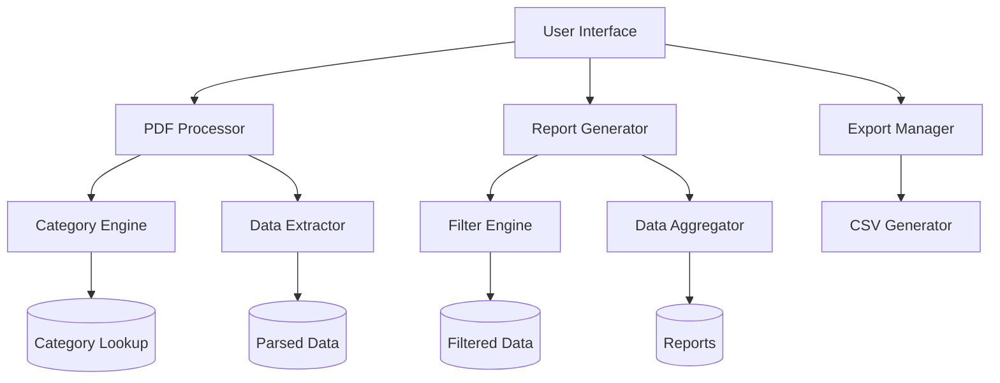

# ZapSlip Documentation

ZapSlip is a browser-based utility for processing and analyzing packing slip PDFs. It provides an intuitive interface for uploading multiple PDFs, categorizing products, and generating detailed reports.

## Table of Contents

1. [System Overview](#system-overview)
2. [Architecture](#architecture)
3. [Features](#features)
4. [File Structure](#file-structure)
5. [Setup Guide](#setup-guide)
6. [User Guide](#user-guide)

## System Overview

ZapSlip streamlines the process of managing and analyzing packing slips by:
- Processing multiple PDF files simultaneously
- Automatically categorizing products
- Providing filterable reports
- Enabling Excel exports of various report types

## Architecture

The system is built using vanilla JavaScript and runs entirely in the browser. It uses PDF.js for PDF processing and implements a modular architecture for maintainability.



## Features

### 1. PDF Processing
- Drag-and-drop interface for file upload
- Support for multiple PDF files
- Real-time processing status
- Automatic text extraction and parsing

### 2. Product Categorization
- Automatic category assignment based on product names
- Support for multiple category types:
  - MISC
  - FRESHITEM
  - MAHABELLY
  - PACKED
  - PROD

### 3. Reporting
- Product Summary View
  - Product-wise quantities
  - Category information
  - Order details
- Category Summary View
  - Category-wise totals
  - Product breakdowns
  - Detailed statistics

### 4. Filtering
- Date range filtering
- Customer filtering
- Product filtering
- Category filtering

### 5. Export Options
- Product Summary export
- Category Summary export
- Orders export
- Detailed Product Breakdown export

## File Structure

```
ZapSlip/
├── lib/
│   ├── pdf-parser.js       # PDF processing logic
│   ├── category-lookup.js  # Product categorization data
│   └── excel-export.js     # Export functionality
├── styles.css              # Application styles
├── index.html             # Main application interface
└── app.js                 # Core application logic
```

## Setup Guide

1. Clone the repository
2. No build process required - it's a static web application
3. Serve the files using any web server
4. Open index.html in a modern browser

## User Guide

### Processing PDFs
1. Drag and drop PDF files onto the upload area or click to browse
2. Click "Process Files" to begin analysis
3. Wait for processing to complete

### Using Reports
1. Use the tabs to switch between Product and Category views
2. Apply filters as needed:
   - Date range
   - Customer name
   - Product name
   - Category
3. Click "Export to Excel" to download reports
4. Select which reports to export from the modal

### Best Practices
1. Ensure PDFs are properly formatted
2. Use consistent product names
3. Regularly update category mappings
4. Export reports for record-keeping 