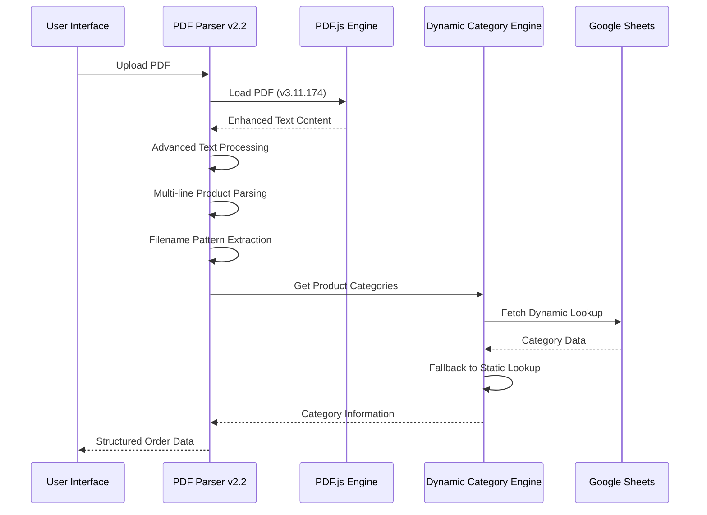
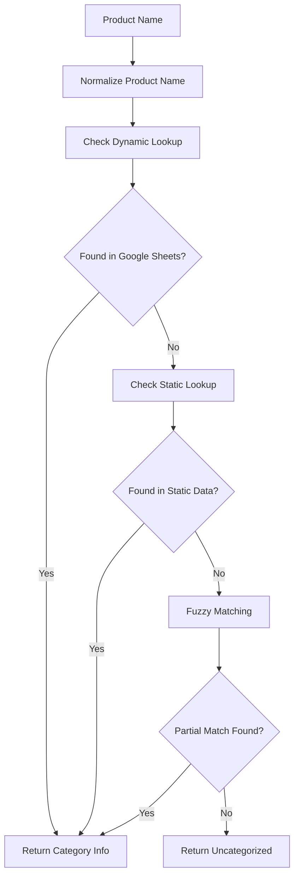
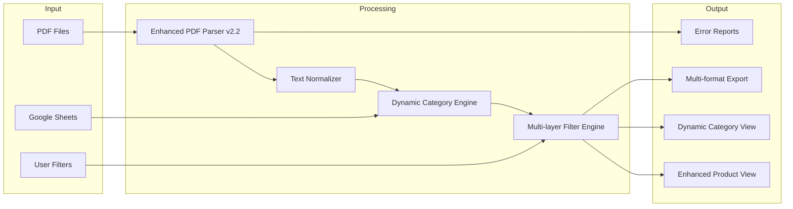
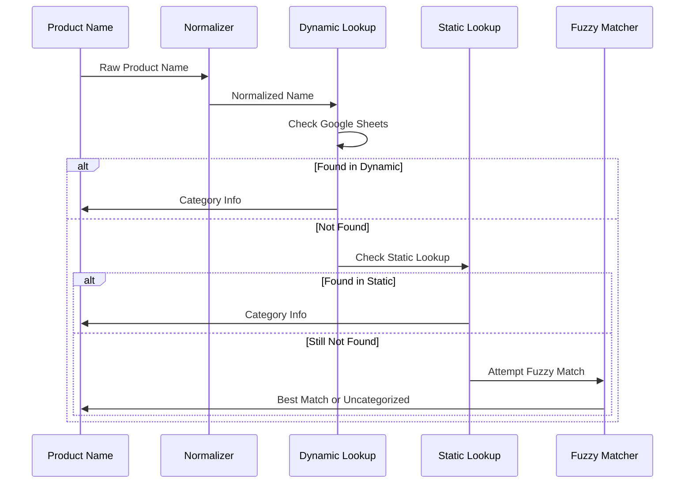

# ZapSlip Technical Reference

This document provides detailed technical information about ZapSlip's implementation, including recent enhancements and architectural improvements.

## Core Components

### 1. Enhanced PDF Parser (`lib/pdf-parser.js` v2.2)

The PDF parser has been significantly enhanced to handle complex parsing scenarios and filename variations.



#### Key Functions and Enhancements:

##### Core Functions:
- `parsePDF(file)`: Enhanced main parsing function with improved error handling
- `extractItems(text)`: Advanced item extraction with multi-line support
- `cleanItemName(name)`: Comprehensive name normalization and cleaning
- `looksLikeProductName(line)`: Intelligent product name detection
- `isPortionSize(line)`: Enhanced portion size recognition
- `isQuantity(line)`: Quantity pattern matching
- `couldBeProductContinuation(line, previousLine)`: Smart continuation detection

##### New Enhancements:
- **Embedded Quantity Detection**: Extracts quantities from product name lines
- **Flexible Filename Parsing**: Handles various filename patterns and edge cases
- **Multi-page Processing**: Comprehensive text extraction across all PDF pages
- **Duplicate Prevention**: Prevents processing the same product multiple times

#### Enhanced Data Structure:
```typescript
interface ParsedOrder {
    orderId: string;
    orderDate: string;
    customer: {
        name: string;
        address: string;
    };
    items: Array<{
        name: string;
        qty: number;
        portionSize?: string;
    }>;
    pdfBlobUrl: string;
    derivedCategories: Array<{
        product: string;
        category: string;
    }>;
}
```

#### Filename Processing Improvements:
```javascript
// Enhanced regex patterns for robust filename parsing
const orderIdMatch = file.name.match(/SSH\d+/);
const orderDateMatch = file.name.match(/(\d{2}\.\d{2}(?:\.\d{4}|\.\d{2})?)/);
const customerNameMatch = file.name.match(/SSH\d+_\s*(.+?)[\s\.]*_\d{2}\.\d{2}/);
```

**Supported Filename Patterns:**
- `packing_slip_SSH3978_ Varada ._15.07.2025.pdf`
- `packing_slip_SSH3979_ Samapika Dash_15.07.2025.pdf`
- `packing_slip_SSH3981_Chitra Gopal_15.07.pdf`
- `packing_slip_SSH3982_Jayashree ._15.07.pdf`

### 2. Dynamic Category Lookup System (`lib/category-lookup.js`)

Revolutionary upgrade from static to dynamic category management with Google Sheets integration.

#### Architecture Overview:


#### Key Components:

##### Dynamic Data Source:
```javascript
// Google Sheets CSV URL for real-time updates
const GOOGLE_SHEETS_CSV_URL = 
    'https://docs.google.com/spreadsheets/d/1WpQGDlmLcBbfIsk9Yehwr2snozVll1swa22eOBiMhnM/export?format=csv&gid=0';

// Dynamic lookup populated from Google Sheets
let DYNAMIC_CATEGORY_LOOKUP = {};
```

##### Product Name Normalization:
```javascript
export function normalizeProductName(name) {
    // Advanced normalization including:
    // - Portion size standardization (ml, ML, Lt, g, gm, kg, etc.)
    // - Empty parentheses removal
    // - Space normalization
    // - Special character handling
    return name.replace(/\s*\d+\s*(ml|ML|Lt|LT|g|gm|GM|kg|KG|Kg)\b/g, '')
              .replace(/\(\s*\)/g, '')
              .replace(/\s+/g, ' ')
              .trim();
}
```

##### Enhanced Matching Strategies:
1. **Exact Match**: Direct lookup in both dynamic and static sources
2. **Normalized Match**: After text cleaning and standardization  
3. **Fuzzy Match**: Word-based partial matching
4. **Fallback**: Static lookup when dynamic source unavailable

#### Data Structure:
```typescript
interface ProductInfo {
    sheet: string;      // Main category (MISC, FRESHITEM, etc.)
    type: string;       // Subcategory (SNACK, BAKERY, etc.)
    originalName?: string; // Original product name if different
}

const CATEGORY_LOOKUP: Record<string, ProductInfo>;
```

#### CSV Processing Pipeline:
```javascript
function parseCSVToLookup(csvText) {
    const lookup = {};
    const lines = csvText.split('\n');
    
    // Process each line with enhanced error handling
    lines.slice(1).forEach((line, index) => {
        try {
            const [productName, sheet, type] = parseCSVLine(line);
            if (productName && sheet) {
                lookup[productName.trim()] = {
                    sheet: sheet.trim(),
                    type: type ? type.trim() : sheet.trim(),
                    originalName: productName.trim()
                };
            }
        } catch (error) {
            console.warn(`Error parsing CSV line ${index + 2}:`, error);
        }
    });
    
    return lookup;
}
```

### 3. Advanced Export Manager (`lib/excel-export.js`)

Enhanced export capabilities with multiple report types and improved data formatting.

#### Export Types and Structure:
1. **Product Summary**: Comprehensive product analysis
2. **Category Summary**: Category-wise breakdowns  
3. **Orders Export**: Complete order details
4. **Detailed Breakdown**: Granular analysis with traceability

#### Enhanced CSV Generation:
```javascript
export function exportToExcel(orders, options = {}) {
    // Generate multiple reports with enhanced data structures
    const reports = {
        productSummary: generateProductSummary(orders),
        categorySummary: generateCategorySummary(orders),
        ordersExport: generateOrdersExport(orders),
        detailedBreakdown: generateDetailedBreakdown(orders)
    };
    
    // Advanced CSV formatting with proper escaping
    Object.entries(reports).forEach(([reportType, data]) => {
        downloadCSV(data, `${reportType}_${timestamp}.csv`);
    });
}
```

### 4. Enhanced Main Application (`app.js`)

Improved state management and UI handling with better error recovery.

#### State Management Enhancements:
```javascript
// Enhanced global state with validation
let uploadedFiles = [];
let processedOrders = [];
let currentScreen = 'upload';
let activeTab = 'products';
let processingStatus = {
    total: 0,
    completed: 0,
    errors: []
};
```

#### Advanced UI Functions:
- `updateReportsUI(orders)`: Enhanced report rendering with loading states
- `applyFilters()`: Multi-layer filtering with performance optimization
- `executeExport()`: Robust export handling with progress tracking
- `handleProcessingErrors()`: Comprehensive error handling and user feedback

## Enhanced Data Flow



## Advanced PDF Processing Pipeline

### 1. Enhanced File Upload
- **Multi-format Validation**: PDF format verification with size limits
- **Batch Processing**: Optimized handling of multiple files
- **Progress Tracking**: Real-time status updates with error recovery
- **Memory Management**: Efficient handling of large files

### 2. Advanced Text Extraction
```javascript
// Enhanced text extraction with positioning
textContent.items.forEach(item => {
    const y = Math.round(item.transform[5]);
    if (lastY !== y && lineTexts.length > 0) {
        pageText += lineTexts.join(' ') + '\n';
        lineTexts = [];
    }
    lineTexts.push(item.str);
    lastY = y;
});
```

### 3. Intelligent Data Parsing
```javascript
// Multi-line product name handling
while (nextIndex < lines.length) {
    const nextLine = lines[nextIndex];
    
    if (isPortionSize(nextLine) || isQuantity(nextLine)) {
        break; // Stop at clear delimiters
    }
    
    if (couldBeProductContinuation(nextLine, productName)) {
        productName += ' ' + nextLine;
        nextIndex++;
        continue;
    }
    
    // Smart lookahead for pattern detection
    const afterThis = nextIndex + 1 < lines.length ? lines[nextIndex + 1] : '';
    if (isPortionSize(afterThis) || isQuantity(afterThis)) {
        productName += ' ' + nextLine;
        nextIndex++;
        break;
    }
}
```

### 4. Enhanced Categorization Pipeline


## Enhanced Error Handling

### 1. PDF Processing Errors
```javascript
try {
    const result = await parsePDF(file);
    return result;
} catch (error) {
    console.error('PDF parsing failed:', error);
    return {
        error: true,
        message: `Failed to parse ${file.name}: ${error.message}`,
        file: file.name
    };
}
```

### 2. Category Lookup Failures
```javascript
async function getCategoryInfo(productName) {
    try {
        // Try dynamic lookup first
        let category = DYNAMIC_CATEGORY_LOOKUP[productName];
        if (category) return category;
        
        // Fallback to static lookup
        category = CATEGORY_LOOKUP[productName];
        if (category) return category;
        
        // Fuzzy matching as last resort
        return attemptFuzzyMatch(productName);
    } catch (error) {
        console.warn('Category lookup failed:', error);
        return null;
    }
}
```

### 3. Export Error Recovery
```javascript
function handleExportError(error, reportType) {
    console.error(`Export failed for ${reportType}:`, error);
    showUserNotification(`Export failed: ${error.message}`, 'error');
    
    // Attempt simplified export
    if (reportType === 'detailed') {
        return attemptBasicExport(orders);
    }
    
    return null;
}
```

## Performance Optimizations

### 1. Lazy Loading and Caching
```javascript
// Cache processed results to avoid recomputation
const processingCache = new Map();

function getCachedResult(fileHash) {
    return processingCache.get(fileHash);
}

function setCachedResult(fileHash, result) {
    processingCache.set(fileHash, result);
}
```

### 2. Debounced Filtering
```javascript
// Prevent excessive filter operations
const debouncedFilter = debounce(applyFilters, 300);

function handleFilterChange(event) {
    debouncedFilter();
}
```

### 3. Batch Processing
```javascript
// Process files in optimized batches
async function processFilesInBatches(files, batchSize = 5) {
    const results = [];
    
    for (let i = 0; i < files.length; i += batchSize) {
        const batch = files.slice(i, i + batchSize);
        const batchResults = await Promise.all(
            batch.map(file => processSingleFile(file))
        );
        results.push(...batchResults);
        
        // Update progress
        updateProgress(i + batch.length, files.length);
    }
    
    return results;
}
```

## Security Considerations

### 1. Data Privacy
- **Local Processing**: All PDF parsing happens client-side
- **No File Upload**: PDFs never leave the user's browser
- **Secure Communication**: HTTPS for Google Sheets integration

### 2. Input Validation
```javascript
function validatePDFFile(file) {
    // File type validation
    if (file.type !== 'application/pdf') {
        throw new Error('Invalid file type');
    }
    
    // Size validation (max 50MB)
    if (file.size > 50 * 1024 * 1024) {
        throw new Error('File too large');
    }
    
    return true;
}
```

### 3. Error Sanitization
```javascript
function sanitizeErrorMessage(error) {
    // Remove potentially sensitive information
    const message = error.message || 'Unknown error';
    return message.replace(/file:\/\/[^\s]+/g, '[file path]');
}
```

## Debugging and Monitoring

### 1. Enhanced Logging
```javascript
// Comprehensive logging system
console.log('=== Starting PDF parsing ===');
console.log('File name:', file.name);
console.log('PDF loaded, pages:', pdf.numPages);
console.log('Full extracted text:', fullText);
console.log('Extracted items:', items);
console.log('=== Final parsed result ===', result);
```

### 2. Performance Monitoring
```javascript
function measurePerformance(operation, fn) {
    const start = performance.now();
    const result = fn();
    const end = performance.now();
    
    console.log(`${operation} took ${end - start} milliseconds`);
    return result;
}
```

### 3. Error Tracking
```javascript
// Track and aggregate errors for analysis
const errorTracker = {
    errors: [],
    addError(error, context) {
        this.errors.push({
            message: error.message,
            stack: error.stack,
            context,
            timestamp: new Date().toISOString()
        });
    },
    getErrorSummary() {
        return this.errors.reduce((summary, error) => {
            summary[error.message] = (summary[error.message] || 0) + 1;
            return summary;
        }, {});
    }
};
```

## Browser Compatibility

### Supported Browsers:
- **Chrome**: 80+ (recommended)
- **Firefox**: 75+
- **Safari**: 13+
- **Edge**: 80+

### Required Features:
- ES6+ support (async/await, modules)
- File API
- Blob API
- Canvas API (for PDF.js)
- CSV download support

### Polyfills and Fallbacks:
```javascript
// Feature detection and fallbacks
if (!window.fetch) {
    throw new Error('Fetch API not supported');
}

if (!window.Promise) {
    throw new Error('Promise not supported');
}
``` 