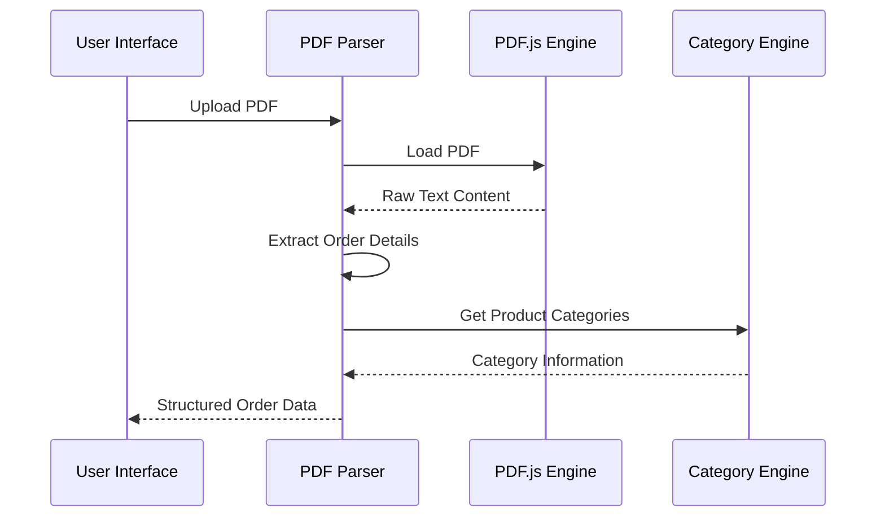
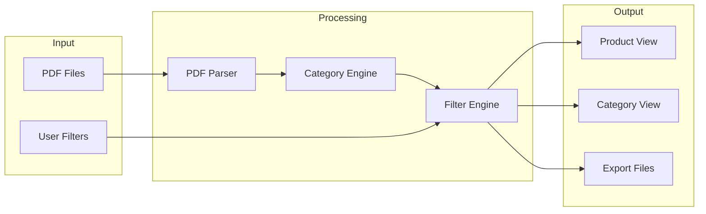
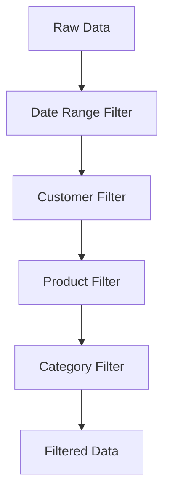

# ZapSlip Technical Reference

This document provides detailed technical information about ZapSlip's implementation.

## Core Components

### 1. PDF Parser (`lib/pdf-parser.js`)

The PDF parser is responsible for extracting and structuring data from PDF files.



#### Key Functions:
- `parsePDF(file)`: Main parsing function
- `extractItems(text)`: Extracts item details from text
- `cleanItemName(name)`: Normalizes product names
- `filterByCategory(orders, category)`: Filters orders by category

### 2. Category Lookup (`lib/category-lookup.js`)

Manages product categorization using a static lookup table.

#### Data Structure:
```typescript
interface ProductInfo {
    sheet: string;      // Main category (MISC, FRESHITEM, etc.)
    type: string;       // Subcategory (SNACK, BAKERY, etc.)
    originalName?: string; // Original product name if different
}

const CATEGORY_LOOKUP: Record<string, ProductInfo>;
```

### 3. Export Manager (`lib/excel-export.js`)

Handles the generation and download of report files.

#### Export Types:
1. Product Summary
2. Category Summary
3. Orders List
4. Detailed Breakdown

### 4. Main Application (`app.js`)

Orchestrates the application flow and manages the UI state.

#### State Management:
```javascript
// Global State
let uploadedFiles = [];
let processedOrders = [];
let currentScreen = 'upload';
let activeTab = 'products';
```

#### Key UI Functions:
- `updateReportsUI(orders)`: Updates report views
- `applyFilters()`: Applies selected filters
- `executeExport()`: Handles report export

## Data Flow



## PDF Processing Pipeline

1. **File Upload**
   - Drag & drop or file browser
   - File type validation
   - Size checks

2. **Text Extraction**
   - PDF.js for text content
   - Page-by-page processing
   - Text normalization

3. **Data Parsing**
   ```javascript
   {
       orderId: string,
       orderDate: string,
       customer: {
           name: string,
           address: string
       },
       items: Array<{
           name: string,
           qty: number,
           portionSize?: string
       }>,
       derivedCategories: Array<{
           product: string,
           category: string
       }>
   }
   ```

4. **Categorization**
   - Direct lookup
   - Normalized comparison
   - Word-based matching

## Report Generation

### Product Summary
- Groups by product name
- Aggregates quantities
- Links to source orders

### Category Summary
- Groups by category
- Product counts
- Total quantities
- Expandable details

## Filter Implementation



### Filter Chain:
1. Date Range
   - Start date
   - End date
2. Customer Name
   - Case-insensitive
   - Partial matching
3. Product Name
   - Case-insensitive
   - Partial matching
4. Category
   - Exact matching
   - Sheet-based

## Export Implementation

### CSV Generation
- UTF-8 encoding
- Proper escaping
- Headers included
- Timestamp-based naming

### File Types
1. `product_summary_[timestamp].csv`
2. `category_summary_[timestamp].csv`
3. `orders_[timestamp].csv`
4. `detailed_breakdown_[timestamp].csv`

## Error Handling

1. **PDF Processing**
   - Invalid file format
   - Parsing failures
   - Missing data

2. **Categorization**
   - Unknown products
   - Missing mappings
   - Ambiguous matches

3. **Export**
   - File system errors
   - Large data sets
   - Browser limitations

## Performance Considerations

1. **PDF Processing**
   - Async processing
   - Progress indicators
   - Memory management

2. **Data Management**
   - Efficient filtering
   - Cached results
   - Lazy loading

3. **UI Updates**
   - Debounced filters
   - Progressive rendering
   - Optimized DOM updates 